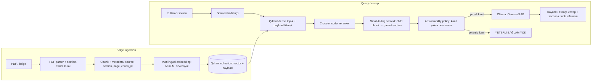

# Mentor Programı PDF RAG — Mimari ve Vector Database Kararı

**Karar tarihi:** 27 Temmuz 2026  
**Seçilen başlangıç vector database:** Qdrant (yerel Docker, kalıcı disk volume)  
**Geçiş yolu:** Aynı collection/payload modeliyle, ihtiyaç oluşursa Qdrant Cloud

## Karar bağlamı

Bu repoda önce retrieval mantığını görünür kılmak için in-memory vector store kuruldu. PDF deneyleri; chunking, dense retrieval, reranking, section-aware ingestion ve yerel LLM ile cevap/no-answer akışını kanıtladı. Ancak in-memory store süreç kapanınca kaybolur; gerçek bir RAG servisinde embedding ve metadata'nın kalıcı bir collection içinde tutulması gerekir.

Mevcut çalışma sınırları:

- 32 GB RAM, GPU yok; yerel model CPU üzerinde çalışıyor.
- Tek bir mentor PDF'iyle başlanıyor, fakat sonraki kurumsal senaryoda çok sayıda belge ve metadata filtresi gerekecek.
- Kaynak metinler yerelde kalmalı; ilk prototip bulut API veya zorunlu yönetilen servis gerektirmemeli.
- Dense retrieval, ileride hybrid retrieval, metadata filtering ve source/citation mapping desteklenmeli.

## Hedef mimari

Bu diyagram hedef mimaridir. Şu an PDF parser, chunking, embedding, dense retrieval, reranking, parent-section context ve Gemma ile üretim çalışıyor. Qdrant katmanı bir sonraki uygulama adımında in-memory store'un kalıcı karşılığı olarak eklenecek. Answerability şu anda prompt/no-answer policy ile ölçülüyor; bağımsız retrieval threshold kalibrasyonu sonraki değerlendirme adımıdır.

## Karşılaştırma

| Seçenek | Yerel geliştirme | Kurumsal / operasyon | Bu proje için karar |
| --- | --- | --- | --- |
| Chroma | Embedded veya server mode ile hızlı prototip; Python odaklı başlangıç kolay | Küçük/orta uygulamalarda pratik; deployment ve yönetim tercihleri ayrıca tasarlanmalı | Hızlı demo için iyi ikinci aday. Bu sprintte kalıcı servis ve metadata/payload kavramlarını daha açık çalışmak istediğimiz için seçilmedi. |
| Qdrant | Docker ile tek servis olarak yerelde çalışır; collection ve payload modeli nettir | Self-host veya Qdrant Cloud seçeneği; filtreleme ve vector arama aynı kavramsal modelle ilerler | **Seçildi.** Yerel veri kontrolü, hafif başlangıç ve sonraki cloud geçişi arasında dengeli. |
| Milvus | Milvus Lite ile hızlı başlangıç mümkün; standalone Docker da var | Dağıtık, Kubernetes-native mimari ve çok büyük ölçek için güçlü; Zilliz Cloud yönetilen seçenek sunar | Mevcut PDF hacmi için fazla karmaşık. Milyonlarca/milyarlarca vektör, yüksek QPS veya çok kiracılı ihtiyaçta yeniden değerlendirilir. |
| Pinecone | Yerel self-host başlangıcı hedefiyle uyumlu değil; servis merkezli kullanım | Yönetilen/serverless deneyimi, operasyon yükünü azaltır | Veri yerelliği, vendor bağımlılığı ve ilk sprintte maliyet/erişim bağımlılığı nedeniyle seçilmedi. Bulut öncelikli ürün için güçlü adaydır. |

## Neden Qdrant?

1. **Mevcut sorunla uyum:** PDF chunk'larının `source`, `section`, `chunk_id` gibi metadata'sı var. Qdrant'ta bu alanlar payload olarak tutulup filtrelenebilir.
2. **Yerel önce yaklaşımı:** Docker ile dış API anahtarı gerektirmeden kalıcı collection oluşturulabilir. Bu, staj ortamındaki gizlilik ve tekrar üretilebilirlik ihtiyacıyla uyumludur.
3. **Öğrenme değeri:** In-memory listeden gerçek client/server vector DB'ye geçerken collection, upsert, idempotent ingestion, payload filter, index persistence ve health check kavramları görünür olur.
4. **Gelecek geçişi:** Aynı veri modeliyle self-host ve managed kullanım arasında geçiş yolu vardır; “sadece notebook demo” seçimi değildir.

Bu karar “Qdrant her projede en iyidir” iddiası değildir. Karar; mevcut veri hacmi, donanım, yerel çalışma, metadata ihtiyacı ve sonraki sprint hedefleri içindir.

## İlk collection tasarımı

| Alan | Tür | Amaç |
| --- | --- | --- |
| `id` | sabit chunk kimliği | Aynı PDF tekrar ingest edilirse upsert/idempotency için |
| `vector` | 384 boyutlu dense embedding | Semantic retrieval |
| `text` | payload metni | Reranker ve context için orijinal kanıt |
| `source` | payload | Belge/kaynak gösterimi |
| `section_id` | payload | Parent-section expansion ve filtreleme |
| `section_title` | payload | İnsan okunabilir citation |
| `chunk_index` | payload | Sıra ve komşu chunk yönetimi |
| `ingestion_version` | payload | Chunking/embedding değişince yeniden indeksleme takibi |

## Kabul kriterleri — sonraki uygulama

- Docker Compose ile yalnız `127.0.0.1` üzerinden erişilebilen Qdrant servisi.
- 384 boyutlu collection ve disk üzerinde kalıcı volume.
- Mentor PDF chunklarının idempotent upsert ile kaydı.
- Uygulama yeniden başlasa da aynı collection'ın bulunması.
- En az bir source/section payload filtresi testi.
- Mevcut in-memory dense retrieval ile Qdrant sonuçlarının aynı sabit sorgularda karşılaştırılması.

## Resmî kaynaklar

1. Chroma, [Introduction](https://docs.trychroma.com/docs/overview/introduction) — local, self-host ve cloud seçenekleri; collection kavramı.
2. Qdrant, [Quickstart](https://qdrant.tech/documentation/quickstart/) — local Docker başlangıcı, collection ve Cloud yönlendirmesi.
3. Qdrant, [Payload](https://qdrant.tech/documentation/concepts/payload/) — vector ile birlikte metadata saklama/filtreleme modeli.
4. Milvus, [resmî README](https://github.com/milvus-io/milvus) — Milvus Lite, standalone, dağıtık/Kubernetes-native ölçek ve Zilliz Cloud bağlantısı.
5. Pinecone, [Get started overview](https://docs.pinecone.io/guides/get-started/overview) — yönetilen/serverless vector database başlangıcı.
