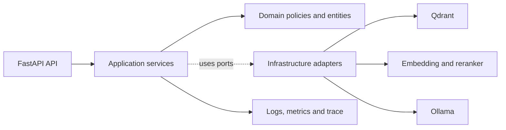
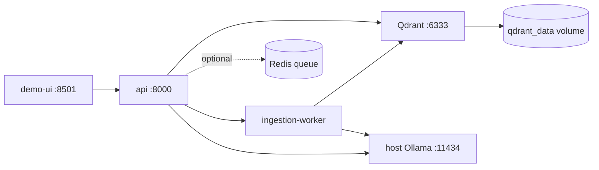

# Document Intelligence Service — Architecture v1

## Amaç

Hafta 1'deki RAG parçalarını, PDF ve kurumsal dokümanlarla çalışabilecek izlenebilir bir servise dönüştürmek. API, retrieval ve model altyapısının ayrıntılarını dışarıya sızdırmadan kararlı bir sözleşme sunar.

## Katman sınırı



- API: HTTP validation, status code, request ID ve response envelope.
- Application: upload, query ve search akışlarını orkestre eder.
- Domain: answerability, evidence ve version kararlarını framework'ten bağımsız tutar.
- Infrastructure: Qdrant, embedding, reranker, PDF parser ve Ollama adapter'larını uygular.

Query orkestrasyonu `RetrievalService` sonucunu doğrudan Ollama'a aktarmıyor. `QueryService` önce domain `AnswerabilityPolicy` ile evidence boşluğu, ham relevance sinyali, margin ve coverage bilgisini değerlendiriyor; rejection kararında LLM atlanıyor. Bu ayrım sayesinde “kanıt yok” ile “model servisi bozuk” farklı response/metric olarak izleniyor.

Ingestion marker profili de runtime ayarıdır: genel PDF'ler `none` ile document-level parent olarak kalır; bilinen mentor PDF ailesi `mentor_program_v1` ile 7 section parent'a ayrılır. Profil pipeline fingerprint'e dahil olduğu için markersız ve section-aware index aynı version kabul edilmez.

Domain katmanı FastAPI, Pydantic, Qdrant veya Ollama import etmez.

## Hedef çalışma topolojisi



Query senkron kalır. PDF ingestion `202 Accepted + job_id` ile asenkron yürür. Redis hedef diyagramda opsiyoneldir; worker fallback ve job persistence kararı ADR ile ölçülecektir.

## Query sequence

```mermaid
sequenceDiagram
    participant C as Client
    participant A as API
    participant Q as QueryService
    participant V as Vector adapters
    participant R as Reranker
    participant G as Answerability gate
    participant L as Ollama

    C->>A: POST /v1/query
    A->>A: validate request + request_id
    A->>Q: execute query
    Q->>V: dense top-30 + sparse top-30
    V-->>Q: candidates
    Q->>Q: RRF top-20
    Q->>R: rerank top-20
    R-->>Q: top-5 evidence
    Q->>G: evidence + score + margin + coverage
    alt sufficient evidence
        G->>L: grounded prompt + evidence
        L-->>Q: answer
        Q-->>A: answered + sources + metrics
    else insufficient evidence
        G-->>Q: no-answer reason
        Q-->>A: no_answer; LLM skipped
    end
    A-->>C: stable response envelope
```

## Failure boundaries

```text
Qdrant down  → readiness 503 / query dependency error
weak evidence → no_answer / LLM latency 0
invalid input → 400 INVALID_REQUEST
active ingestion during delete → 409 DOCUMENT_BUSY
```

Bir altyapı arızası, kanıt bulunamaması gibi raporlanmaz.
